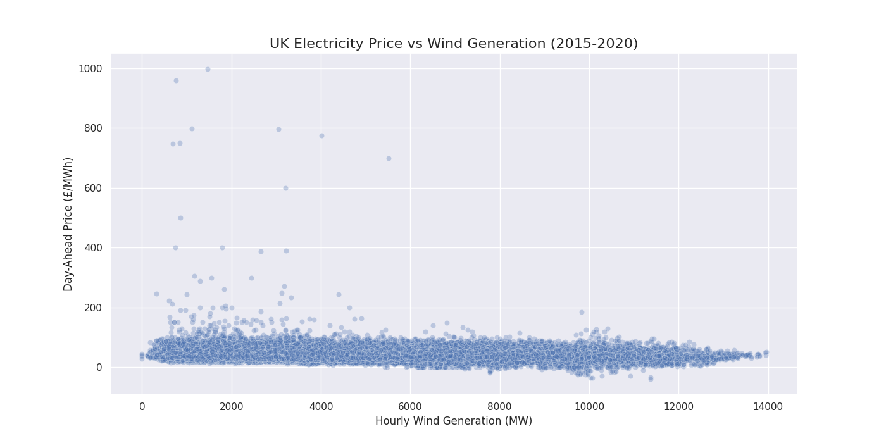

# UK Wind Generation & Power Price Analysis

## 1. Objective
This project analyzes the impact of wind power generation on wholesale electricity prices in the United Kingdom using data from 2015-2020.

## 2. Data Source
The data was sourced from the Open Power System Data (OPSD) project, using their public time series dataset for Europe.

## 3. Methodology
The dataset was loaded into Python using the **pandas** library. The relevant UK data for day-ahead price and actual wind generation was selected, cleaned, and processed. The relationship was then visualized with a scatter plot using **Matplotlib** and **Seaborn**, and quantified with a Pearson correlation coefficient.

## 4. Key Findings
A clear negative relationship was observed between wind generation and electricity price. The scatter plot below demonstrates that periods of high wind generation significantly reduce price volatility and suppress high price spikes.

While the linear correlation coefficient was low at **-0.086**, this is because the relationship is not strictly linear. The visual evidence clearly shows the bearish (price lowering) impact of high renewable generation on the wholesale market.

## 5. Further Improvements
- Analyze the impact of other generation sources (e.g., solar, gas).
- Incorporate electricity demand (load) data into the model.
- Use more advanced statistical methods to model the non-linear relationship.
