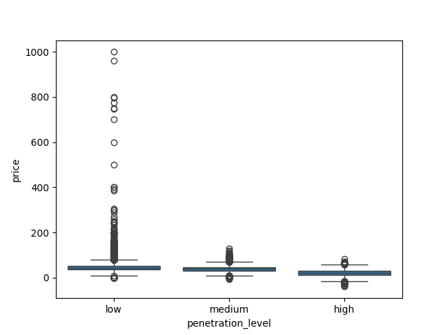

# UK Wind Generation & Power Price Analysis

## 1. Objective
This project analyses the impact of renewable power generation on wholesale electricity prices in the United Kingdom, using hourly data from 2015 to 2020.

## 2. Data Source
The data was sourced from the Open Power System Data (OPSD) project, using their public time series dataset for Europe.

## 3. Methodology
The dataset was loaded and manipulated in Python using the **pandas** library. Key data points for Great Britain, including the day ahead price, actual load, and generation from wind and solar, were selected and cleaned.

To analyse the market impact, a **'renewable penetration'** metric was engineered by calculating the proportion of total demand (load) met by combined wind and solar generation each hour. These hours were then categorised into 'Low', 'Medium', and 'High' penetration levels. The relationship was visualised using **Matplotlib** and **Seaborn** to create box plots and scatter plots.

## 4. Key Findings
The project's main finding is a clear and strong relationship between the level of renewable penetration and electricity price behaviour. As the share of demand met by renewables increases, both the average price and price volatility fall dramatically.

The box plot below illustrates this perfectly. In hours with **high renewable penetration**, the median price is significantly lower and extreme price spikes are almost completely eliminated. In contrast, hours with **low renewable penetration** show much higher volatility and are responsible for all the extreme high price events.

Further analysis of just wind generation in the scatter plot below supports this conclusion. It shows that high wind output constrains prices to a low, stable band, confirming the bearish (price lowering) impact of renewable generation on the wholesale market.

## 5. Further Improvements
* Analyse the impact of other generation sources, for example gas and nuclear.
* Incorporate electricity demand forecast data to analyse forecast errors.
* Use more advanced statistical methods to model the non linear relationship.
